# CarND-Semantic-Segmentation-Project

Self-Driving Car Engineer Nanodegree Program, Term3. CarND-Semantic-Segmentation-Project solution by Ernesto Cañibano.

## Training the model

In this section i explain the process of train the model.

### Hyperparameters

After several trainings, finally the hyperparameters selected for the final model are the following:
* **Dropout = 0.5** [Line 134](./main.py#L134)
* **Learning rate = 1e-5** [Line 135](./main.py#L135)
* **Epochs = 50** [Line 154](./main.py#L154)
* **Batch size = 4** [Line 155](./main.py#L155)
* **Standard deviation = 1e-2** [Line 62](./main.py#L62)
* **L2 regularization in layers = 1e-4** [Line 63](./main.py#L63)
* **L2 regularization additional = 1e-4** [Line 96](./main.py#L96)
 
### Training process

The first attempts were made without L2 additional regularization and with a value of the **L2 regularization value in layers** of **1e-5**.

###### 10 epochs
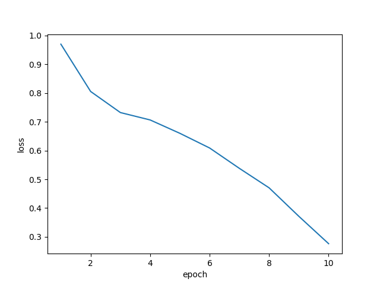 
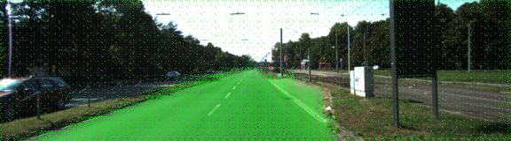
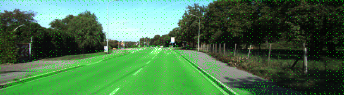 
###### 20 epochs
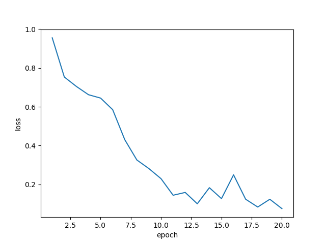 
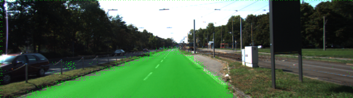
 
###### 30 epochs
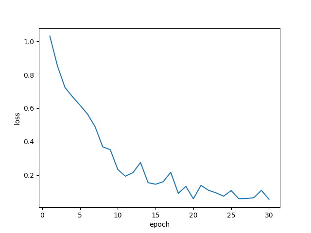 
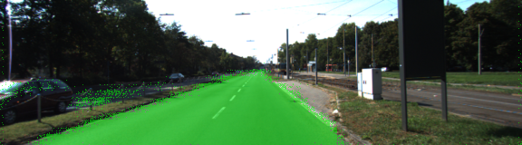
 
###### 40 epochs
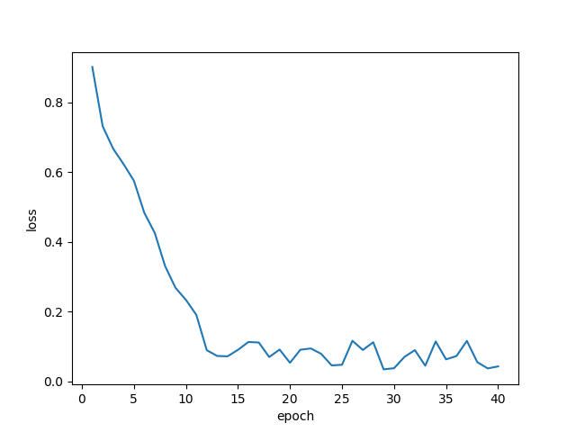 

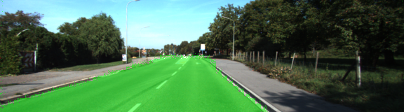 
###### 50 epochs
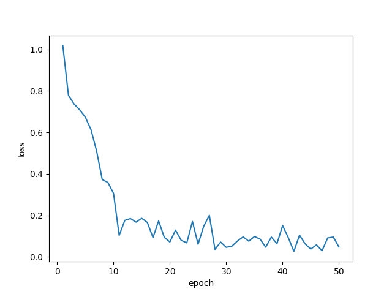 

 

A test with **80 epochs** was made too but the result was pretty similar to the 50 epochs test.

Later I tried to improve the model adding an **additional L2 regularization**. I made trainings with different values but the best was with a value of **1e-4**.

###### 50 epochs, 1e-4 additional L2 regularization
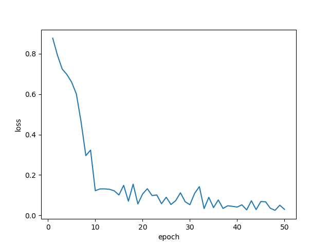 
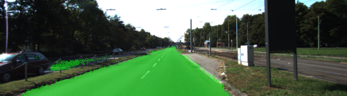
 

Finally i tried some more test testing different values for the **Dropout** but I decided use **0.5**.

### Results
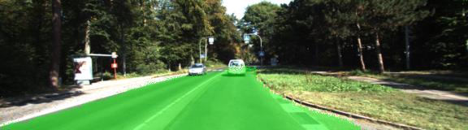
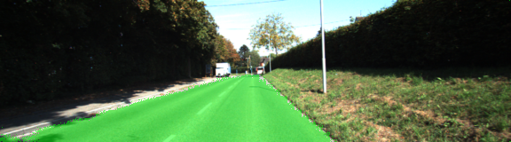
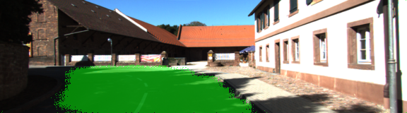
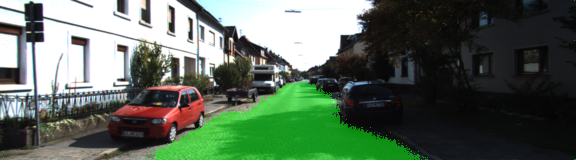
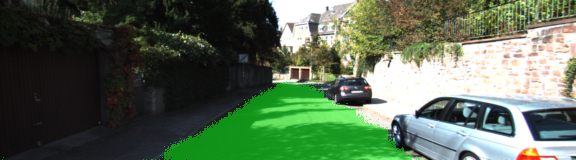
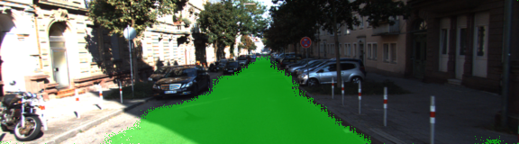

